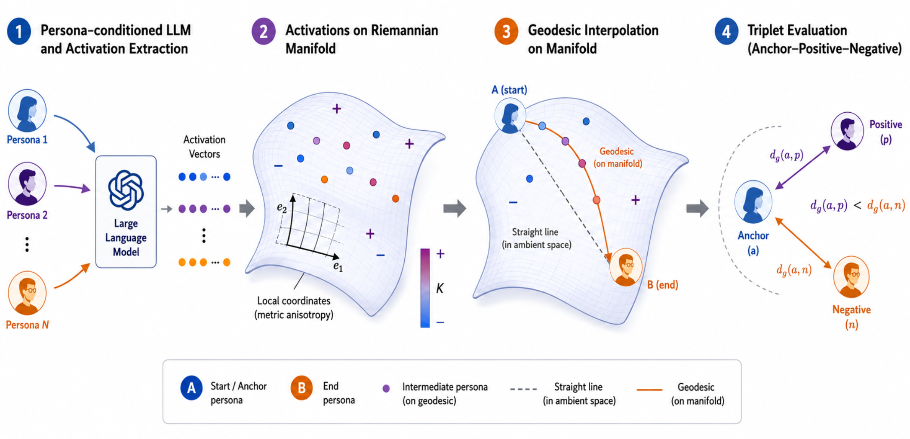
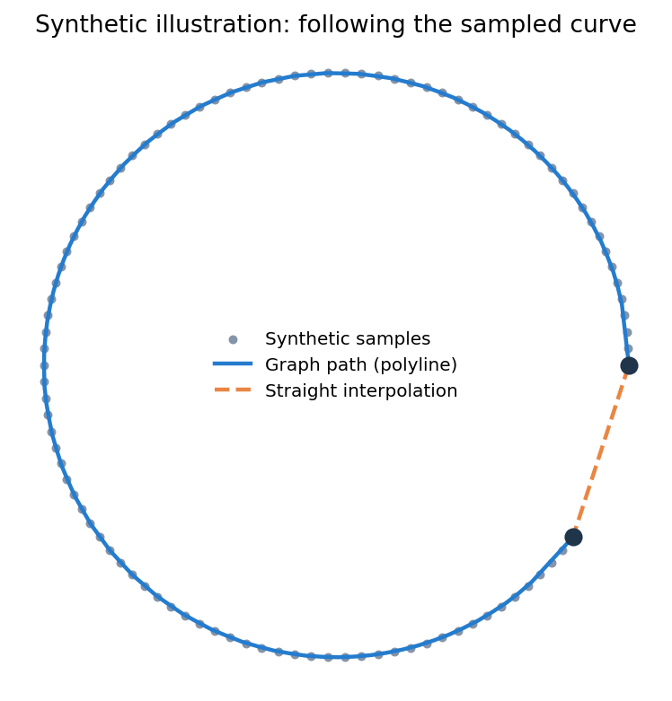

# PersonaManifold: Revealing and Exploiting Curved Geometry in LLM Persona Representations

**Accepted to NeurIPS 2026** · [Method notes](docs/METHOD.md) · [Data interface](docs/DATA.md)

**Rui Xu**, **Yinghui Xu**, **Libo Wu**

Fudan University; Rui Xu and Libo Wu are also affiliated with Shanghai Innovation Institute.

Contact: `24110240097@m.fudan.edu.cn`

Persona representations need not form a flat space. **PersonaManifold** studies
their local geometry and follows graph geodesics to interpolate between personas.
Behavioral Similarity Triplets (BST) evaluate whether these geometric distances
agree with how personas behave.

This repository is a **minimal reference implementation**, newly written from the
paper's method. It provides runnable geometry and evaluation components, rather
than the original experiment pipeline or a reproduction of the reported results.

## Method overview



1. **Represent personas.** Average response activations across matched probes and
   subtract a neutral-prompt baseline.
2. **Estimate geometry.** Reduce dimension with PCA, estimate local covariance
   metrics, and build an undirected weighted nearest-neighbor graph.
3. **Follow the manifold.** Find shortest paths and map intermediate points back
   into activation space to obtain steering vectors.
4. **Evaluate behavior.** Compare geometric distances against independently
   constructed anchor/positive/negative triplets.

## Install and try it

Python 3.10 or newer. The core requires only NumPy and SciPy.

```bash
git clone https://github.com/airaer1998/PersonaManifold.git
cd PersonaManifold
python -m pip install -e .
python examples/quickstart.py
```

The CPU example constructs a synthetic circular arc, compares graph paths with
straight interpolation, evaluates triplets labeled by the known generating
angle, and computes one edge's curvature. No GPU, model weights, or API key is
needed. Its output is **synthetic demonstration data, not paper results**.



To regenerate the illustration:

```bash
python -m pip install -e '.[plot]'
python examples/quickstart.py --plot outputs/synthetic_demo.png
```

## Use your own activations

```python
import numpy as np
from personamanifold import PersonaManifold, center_activations, triplet_accuracy

# Obtain these arrays from your own model; see docs/DATA.md.
responses = np.load("responses.npy", allow_pickle=False)  # (personas, probes, hidden)
neutral = np.load("neutral.npy", allow_pickle=False)      # (probes, hidden)
vectors = center_activations(responses, neutral)

manifold = PersonaManifold(
    n_neighbors=8, tangent_dim=2, variance=0.99, ridge=1e-3,
).fit(vectors)

path = manifold.shortest_path(0, 1)
steering = manifold.steering_vectors(0, 1, n_steps=11, strength=1.0)
np.save("steering.npy", steering)

# Triplet rows contain persona indices: [anchor, positive, negative].
# Construct labels from held-out behavior, not from the graph being evaluated.
triplets = np.load("triplets.npy", allow_pickle=False)
print(triplet_accuracy(manifold.distances(), triplets))
```

The numerical defaults are small-example settings, **not paper hyperparameters**.
Use at least nine distinct persona vectors for this configuration; adjust the
neighbor count and tangent dimension to your data. Model extraction, residual
hooks, generation, and layer/strength tuning are left to the caller.

## What is included

| Component | This release |
| --- | --- |
| Neutral subtraction | Mean of aligned response activations |
| Dimension reduction | Centered PCA retaining a chosen variance fraction |
| Local metric | Top covariance eigenpairs with ridge regularization |
| Graph geodesics | Union-symmetrized kNN graph and Dijkstra shortest paths |
| Steering | Equal weighted arc-length **polyline** samples, inverse PCA, endpoint norm interpolation |
| Curvature | Exact optimal transport for an individual edge on a small graph |
| BST evaluation | Choice/cosine behavioral distances and strict triplet accuracy |
| Paper-scale experiments | Not included: model extraction, tangent-space splines, dimension estimation, full BST corpus, human annotations, checkpoints, and evaluation sweeps |

The polyline is a deliberate simplification of the paper's local-tangent cubic
spline. Curvature uses uniform neighbors of the symmetrized graph. Centered PCA
is inverted with its mean restored before computing activation-space steering
norms. [Method notes](docs/METHOD.md) describe these conventions and limitations.

## Repository layout

```text
src/personamanifold/
  geometry.py       # activation aggregation, PCA, metric graph, paths, steering
  curvature.py      # small-graph Ollivier–Ricci edge curvature
  evaluation.py     # behavioral distances and triplet consistency
examples/
  quickstart.py     # deterministic CPU demo; optional plot
tests/              # geometry, transport, evaluation, and validation checks
docs/               # method scope and input/output conventions
assets/             # paper overview and generated synthetic illustration
```

## Validation

```bash
python -m pip install -e '.[dev]'
python -m pytest -q
python -m build
```

Tests check neutral subtraction, PCA reconstruction, metric edge weights,
curved-path behavior, endpoint magnitudes, disconnected graphs, a known
triangle-curvature result, and behavioral triplet scoring. They do not establish
LLM steering quality or reproduce the paper's benchmark numbers.

## Citation

```bibtex
@inproceedings{xu2026personamanifold,
  title     = {PersonaManifold: Revealing and Exploiting Curved Geometry in LLM Persona Representations},
  author    = {Xu, Rui and Xu, Yinghui and Wu, Libo},
  booktitle = {Advances in Neural Information Processing Systems},
  year      = {2026},
  note      = {Accepted}
}
```

## License and development

Code is released under the [MIT License](LICENSE). The paper overview in
`assets/method.png` is reproduced from the authors' manuscript and is excluded
from the code license. Upstream persona datasets and model weights are not
redistributed. This compact implementation and its tests were prepared with
OpenAI Codex assistance.
